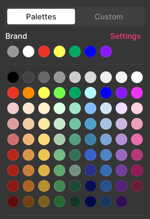
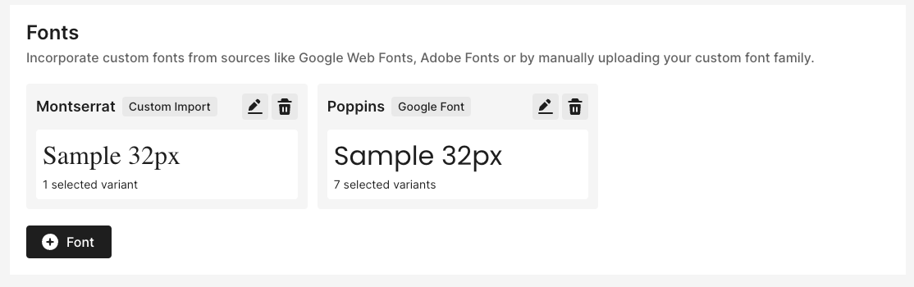

:last-update-label:
[#top]
= Brand colors and fonts
:page-title: Brand colors and fonts  // Default page title, modify per article
:page-tags: color, font, styling, branding
:page-aliases:  // Add aliases as /path/to/old/url
:page-status: draft  // Options: draft, in-review, published, deprecated
:page-description: Brief description of article // Optimize for SEO
:author: Author Name
:keywords: color, font, styling, branding, design
:page-diataxis: explanation // Options: explanation (explaining a concept not guiding users through a process), how-to (guiding users through a process with a prescriptive outcome), reference, tutorial (teaches users a new concept)

// Article content starts here
[#abstract]
[abstract]
--
This article explains what brand fonts and colors are and links to guides for setting your account's custom fonts and brand colors.
--

[#intro]
== Introduction

You can specify up to nine colors and unlimited fonts to be displayed prominently anywhere color or font footnote:[Custom fonts are not available on https://help.sendlane.com/article/404-how-to-customize-your-unsubscribe-and-email-preferences-pages[opt-in/opt-out landing pages]] pickers appear in Sendlane.

[IMPORTANT]
Brand colors and fonts are set for an entire account.
It is not possible to set separate brand colors or fonts for more than one store under the same account.

[#colors]
== Brand colors

You can use the color palette section of the branding page to select up
to nine colors that will always be at the top of the color picker
wherever it appears in Sendlane. Read more about branding colors
https://help.sendlane.com/article/683-how-to-set-and-use-branding-colors[here].

[#font]
== Brand fonts

You can use the fonts section of the branding page to import preferred
Google, Adobe, or custom fonts you've purchased or are otherwise
licensed to use, plus fallback fonts. Read more about branding fonts
https://help.sendlane.com/article/684-how-to-set-and-use-branding-fonts[here].

