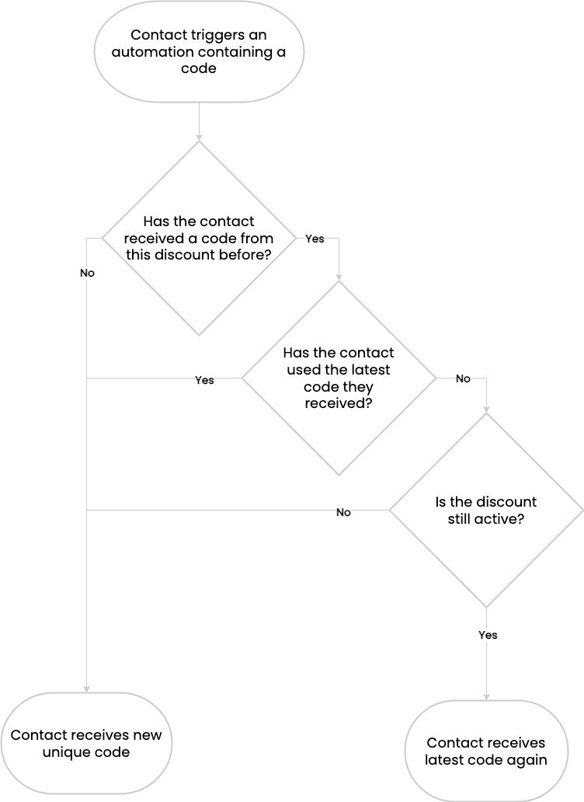

[[top]]
==== Overview

You can generate and send Shopify coupon codes that are active for a
discrete period of time, perfect for campaigns, or set up evergreen
discounts for automations. Read on for details about each type of
Shopify coupon.

==== In this guide

* link:#glossary[Coupon glossary]
* link:#types[Coupon types and when to use them]
* link:#rd-generation[Relative duration code generation]
* link:#repitition[Code repetition]

'''''

[[glossary]]
=== Coupon glossary

[cols=",",options="header",]
|===
|Term |Definition
|`+Discount+` |A https://help.shopify.com/en/manual/discounts[discount]
created in your Shopify store.

|`+Coupon+` |A batch of codes created in your Sendlane account, which is
connected to a discount. You can see your account’s coupons by
navigating to Account Settings > Coupons. Each item on this page is a
coupon.

|`+Code+` |The unique code each contact receives, comprised of the
prefix you enter in Sendlane and the random alphanumerics generated from
the discount (for example, WELCOME15-123ABC).
|===

link:#top[Back to top]

'''''

[[types]]
=== Coupon types and when to use them

You can create coupons in Sendlane for Shopify discounts that are active
between two set dates (Shopify Discount Active Dates), or for a relative
duration.

. *Shopify Discount Active Dates* - Use this option for time bound
discounts, like a one week sale, sent via campaign. The codes will be
active during the dates entered in the Shopify discount (for example, a
coupon active for one week from 1/1/24 to 1/8/24).
. *Relative Duration* - Use this option for evergreen discounts sent via
automation. The Shopify discount has a start date, but no end date and
the coupon is “active,” meaning it is being sent to contacts for the
time period selected in Sendlane. The Shopify discount may still be
active (codes will still work in your store) after the relative duration
period set for the coupon in Sendlane has ended.

[[sad-generation]]
===== Shopify Active Dates code generation

Use this option for campaigns

Coupons using the Shopify Active Dates method are active for a discrete
period of time and sent in campaigns with pre-determined audiences.

When you create a Shopify Discount Active Dates coupon, you’ll enter the
estimated number of codes needed and have the option to select an
evergreen discount from your Shopify store as a fallback in case your
campaign requires more codes than you anticipated. The fallback will be
rendered in contacts’ emails once all unique codes have been sent.

 You should use the campaign builder’s audience estimation to estimate
how many codes your campaign will require.

[[campaign-stop]]
====== ⚠️ Campaigns will stop sending when coupons are depleted if no fallback is selected

See the Replenish a coupon section in
https://help.sendlane.com/article/507-how-to-generate-unique-coupons-for-shopify?preview=63862d840e46a425a2584ee9#replenish[How
to generate unique coupons for Shopify] and
https://help.sendlane.com/article/649-how-to-stop-and-restart-a-campaign[How
to start and stop a campaign] for instructions on restarting your
campaign.

[[rd-generation]]
===== Relative duration code generation

Use this option for automations

Batches of relative duration codes are generated every day so that
contacts triggering the automation have the same amount of time to use
their codes before they expire, regardless of when they trigger the
automation.

For example, let’s say you set your relative duration coupon in Sendlane
to seven days. Contacts who trigger the automation on 1/1/24 receive a
code valid for seven days plus an additional buffer day, meaning the
first batch of codes will expire on 1/9/24. At midnight on 1/2/24,
Sendlane duplicates the original discount. Contacts who trigger the
automation on 1/2/24 will receive a code from the duplicated discount,
which will provide codes valid until 1/10/24.

This process repeats for each day of your relative duration coupon to
ensure that all contacts can use their codes for the same amount of
time.

All relative duration coupons include a one-day buffer to ensure
contacts can use their discounts before they expire, even if the
duration is set to less than one day. The buffer cannot be changed or
removed.

Coupons in your Sendlane account will not be duplicated (in other words,
you will see one coupon entry in Sendlane and multiple discounts in
Shopify).

link:#top[Back to top]

'''''

[[repitition]]
=== Code repetition

When contacts trigger an automation containing Shopify coupon codes,
they receive the same code until they use it or the discount expires, at
which point they receive a new code.

link:#top[Back to top]
