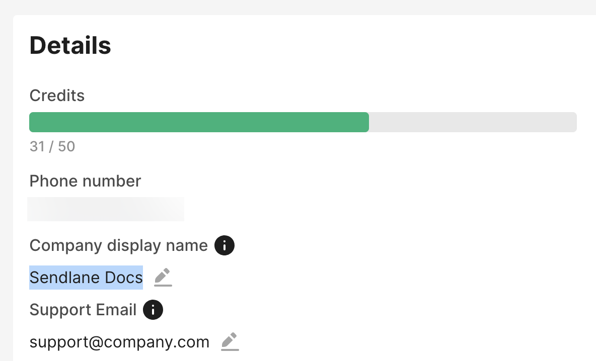

:last-update-label:

= How Sendlane encodes SMS and MMS messages
:page-title: How Sendlane encodes SMS messages  // Default page title, modify per article
:page-tags: sms, emoji, billing
:page-aliases:  // Add aliases as /path/to/old/url
:page-status: draft  // Options: draft, in-review, published, deprecated
:page-description: Learn how Sendlane determines SMS message size and cost // Optimize for SEO
:author: Author Name
:keywords: sms, emoji, billing, cost
:page-diataxis: explanation // Options: explanation, how-to, reference, tutorial

// Article content starts here
[abstract]
--
This article explains how Sendlane determines how many characters, segments, and credits each SMS or MMS message requires.
--

[#intro]
== Introduction
The size and cost of SMS and MMS messages are determined by the types of characters and/or media present in the message.

[#encoding]
== How characters are encoded
If you've drafted your own SMS message in Sendlane and included emojis or other "non-standard" characters, you may have noticed that when you add your emoji or special characters, your entire message takes up more characters and segments. This is because emojis and other special characters use more data than standard characters.

=== Standard characters
Most commonly used characters, including all Latin-script letters and some symbols, are included in the GSM 7-bit default alphabet. Every character in the GSM 7-bit alphabet

[#mms]
== How an SMS message becomes an MMS message
Image, .GIF

[#sms-calculator]
== Estimate the rough cost of your message

You can estimate the rough cost of your message by using the character, segment, and credit calculator in the SMS message builder or the calculator below.

The cost and size of SMS messages cannot be definitively determined before the message is sent because:

. Contacts who use AT&T, have a Canadian phone number, or are receiving an SMS from your account for the first time (regardless of carrier or country) have `Text STOP to stop` appended to the message in keeping with SMS carrier guidelines. This message cannot be removed.
. If you include personalization in your SMS message, the number of characters required to render the personalization varies for each contact. Personalization is rendered when the message is sent. For example, if you include `{{ contact.first_name }}`, the message sent to a contact named Sam requires fewer characters than a message sent to a contact named Samantha.

To use the calculator below, enter your business name exactly as it appears in the https://app.sendlane.com/sms-preferences[SMS details page]. Any variation on the business name you see in Sendlane will cause the calculator below to estimate inaccurately.

---
++++
<label for="business-name">Business Name:</label>
<input type="text" id="business-name" placeholder="Enter your business name..." />

<textarea id="sms-input" placeholder="Your message..." disabled></textarea>

    Characters Remaining: 150 |
    Segments Used: 1

++++
---

[#troubleshooting]
== Troubleshooting

[#calculator-inconsistency]
===== The calculator in this article is showing different estimates than the calculator in the SMS message builder in Sendlane!
If the business name entered in the calculator above is different than the business name exactly as it appears in the https://app.sendlane.com/sms-preferences[SMS details page], the calculation will be different than the calculation you see in Sendlane.

If you've entered your business name as it appears in Sendlane and the calculations are still different, consider the calculator in Sendlane accurate. Please reach out to product support to report inconsistencies.